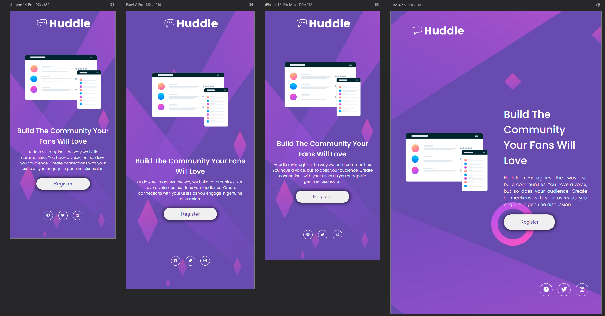

# Projeto Huddle Landing Page

Este projeto é uma página web simples. A estilização foi feita com CSS puro, sem o uso de frameworks, focando no entendimento dos seletores, classes, ids, e propriedades de layout.

## Índice

- [Sobre](#sobre)
- [Tecnologias Utilizadas](#tecnologias-utilizadas)
- [Funcionalidades](#funcionalidades)
- [Contato](#contato)

## Sobre
 

 
Este é meu primeiro projeto desenvolvido utilizando as linguagens HTML e CSS!
Demorei um tempo considerável para desenvolver esse projeto, mas sinto que aprendi bastante sobre responsividade, além de adquirir prática com o FlexBox.
Busquei fazer uma responsividade bem completa, abrangendo telas 4k até as menores telas mobile.

## Tecnologias Utilizadas

- **HTML5:** Estruturação da página
- **CSS3:** Estilização e layout
- **Google Fonts e FontAwesome:** Tipografia personalizada

## Funcionalidades

- Estrutura básica de uma página HTML
- Estilização de texto e cores com CSS
- Layout responsivo abrangente com uso de Flexbox
- Uso de fontes personalizadas com Google Fonts e Font Awesome

## Contato

- linkedin - https://www.linkedin.com/in/breno-santos-734752287/

- portfolio - https://breno-santos95.github.io/portfolio/

- instagram - @nbrrx

